# Vehicle-Detection-and-Tracking
### Udacity Self-Driving Car Engineer Nanodegree. Project: Vehicle Detection and Tracking

This Project is the fifth task of the Udacity Self-Driving Car Nanodegree program. The main goal of the project is to create a software pipeline to identify vehicles in a video from a front-facing camera on a car. Additionally, an [Advanced Lane Line](https://github.com/NikolasEnt/Advanced-Lane-Lines) finding algorithm was added from the fourth task of the Nanodegree program.

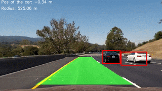

**Result:** [video](https://youtu.be/waYJjmkRZfw)

For details on this and other projects, see my [website](https://nikolasent.github.io/proj/proj2)

## Content of this repo

- `VehicheDetect.ipynb` - Jupyter notebook with code for the project
- `laneline.py` - python program for lane line detection from the [project 4](https://github.com/NikolasEnt/Advanced-Lane-Lines).
- `test_images` - a directory with test images
- `camera_cal` - a directory with camera calibration images from the [project 4](https://github.com/NikolasEnt/Advanced-Lane-Lines).
- `project_video_proc.mp4` - the result video
- `project_video.mp4` - the original raw video from [Udacity](https://github.com/udacity/CarND-Vehicle-Detection)

**Note:** The repository does not contain any training images. You have to download and unzip the image datasets of vehicles and non-vehicles provided by Udacity and place them in appropriate directories on your own.
Please, see links under "Data loading" header in the [VehicheDetect.ipynb](./VehicheDetect.ipynb) notebook.

## Classifier

Features are needed to train a classifier and make predictions on the test or real-world images.

The project required to build a classifier that is able to answer if there is a car in a given image (subset of the whole image). To address this task three types of features were used: HOG (Histogram of Oriented Gradients) (shape features), binned color (color and shape features) and color histogram features (color only features). This combination of features can provide enough information for image classification.

Firstly, an automated approach was applied to tune the HOG parameters (`orientations, pixels_per_cell, cells_per_block`).

Something like:
```Python
from skopt import gp_minimize
space  = [(8, 64),                  # nbins
          (6, 12),                  # orient
          (4, 16),                   # pix_per_cell
          (1, 2)]                   # cell_per_block
i = 0
def obj(params):
    global i
    nbins, orient, pix_per_cell, cell_per_block = params
    car_features = extract_features(cars[0:len(cars):10], nbins, orient, pix_per_cell, cell_per_block)
    notcar_features = extract_features(notcars[0:len(notcars):10], nbins, orient, pix_per_cell, cell_per_block)
    y = np.hstack((np.ones(len(cars[0:len(cars):10])), np.zeros(len(notcars[0:len(notcars):10]))))
    X = np.vstack((car_features, notcar_features)).astype(np.float64)                        
    # Fit a per-column scaler
    X_scaler = StandardScaler().fit(X)
    # Apply the scaler to X
    scaled_X = X_scaler.transform(X)
    X_train, X_test, y_train, y_test = train_test_split(scaled_X, y, test_size=0.2, random_state=22)
    svc = LinearSVC()
    svc.fit(X_train, y_train)
    test_acc = svc.score(X_test, y_test)
    print i, params, test_acc
    i+=1
    return 1.0-test_acc
    
res = gp_minimize(obj, space, n_calls=20, random_state=22)
"Best score=%.4f" % res.fun
```

However, results were not very good because it ended with high numbers for HOG parameters which results in very slow feature extraction with comparable to less computational-expensive parameters set accuracy. That is why, the parameters for HOG as well as parameters for other features extractors were finetuned manually by try and error process so that it optimizes accuracy and computation time.

Here is an example of a train image and its HOG:

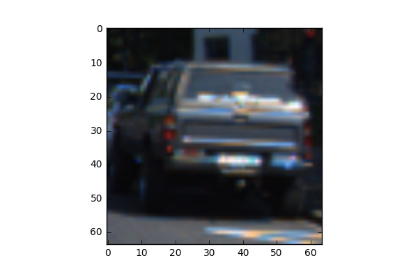 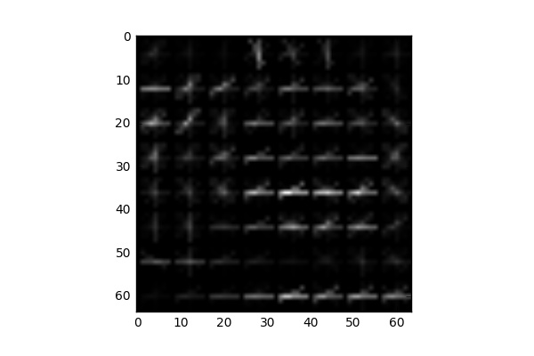

Final parameter for feature extraction:

```Python
color_space = 'LUV' # Can be RGB, HSV, LUV, HLS, YUV, YCrCb
orient = 8  # HOG orientations
pix_per_cell = 8 # HOG pixels per cell
cell_per_block = 2 # HOG cells per block
hog_channel = 0 # Can be 0, 1, 2, or "ALL"
spatial_size = (16, 16) # Spatial binning dimensions
hist_bins = 32    # Number of histogram bins
```

Normalizing ensures that a classifier's behavior isn't dominated by just a subset of the features, and that the training process is as efficient as possible. That is why, feature list was normolized by the `StandardScaler()` method from `sklearn`. The data is splitted into thaining and testing subsets (80% and 20%). The classifier is a linear SVM. It was found that it performs well enough and quite fast for the task. The code chunk under *Classifier* represents these operations.


## Sliding Window and the classifier testing

Basic sliding window algoritm was implemented in the same way to one presented in Udacity's lectures (See the code chunks under *Slide window* header). It allows to search a car in a desired region of the frame with a desired window size (each subsamled window is rescaled to 64x64 px before classifing by the SVC).

The window size and overlap should be wisely selected. Size of the window should be compared to the size of an expected car. These parameters were set to mimic perspective.

There are some sample results for a fixed window size (128x128 px) and overlap for the provided test images:

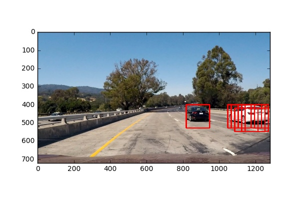
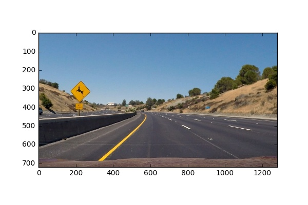
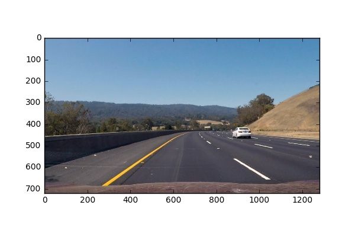
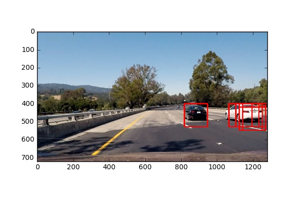
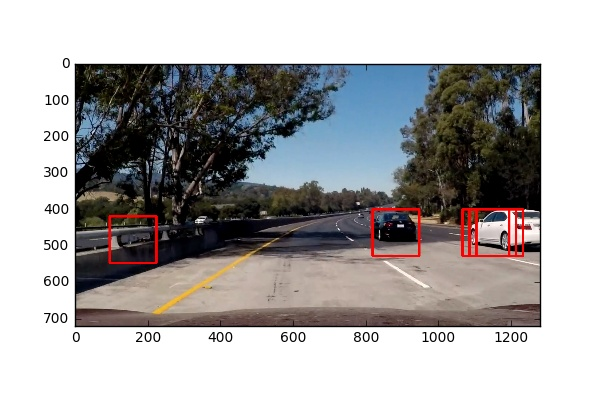
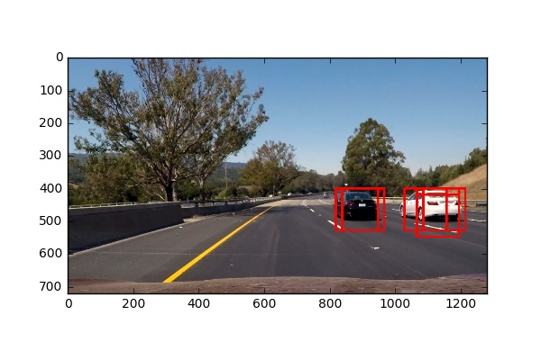

As we can see on examples above, the classifier successfully finds cars on the test images. However, there is a false positive example, so, we will need to apply a kind of filter (such as heat map) and the classifier failed to find a car on th 3rd image because it is too small for it. That is why, we will need to use multi scale windows.

### Implemented ideas:

- Images were preprocessed by undistortion process from the [Advanced Lane Line](https://github.com/NikolasEnt/Advanced-Lane-Lines) finding project

- To increase the classifier accuracy, feature extraction parameters were tuned. The data was augmented by flipped images.

- To reduce number of false positives a heatmap with a threshold approach was implemented in the same to the suggested in the lectures way. For video the heatmap is accumulated by two frames which reduces number of outliers false positives.

- To increase performance it is needed to analize the smallest possible number of windows. That is why, one can scan with a search window not across the whole image, but only areas where a new car can appear and also we are going to scan areas where a car was detected (track cars) 

*There is an example of a new car detection ROI:*

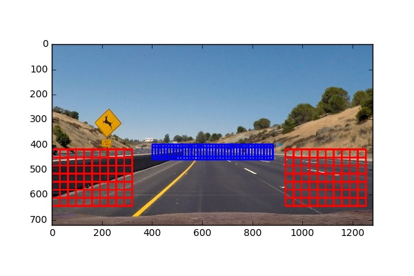

*And a car tracking ROI:*

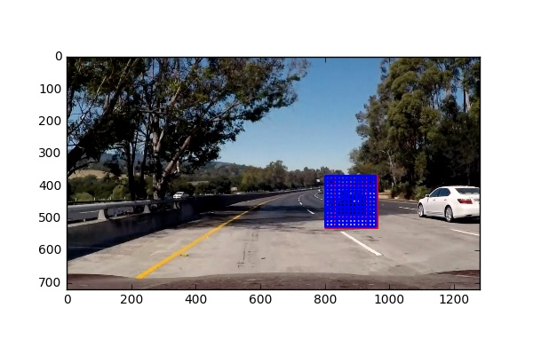

- It is important to use different scale of the classifiers window on different parts of the image due to perspective. So, different ROI  window sizes were applied on different areas (realized in the `frame_proc` function).

- In order to reduce jitter the function `filt` applies a simple low-pass filter on the new and the previous cars boxes coordinates and sizes (see under the *Frames processing* header) with weight `ALPHA=0.75` of the previous data. This makes car boundaries on video quite smooth.

- To increase performance the analizys was skiped for every 2nd frame because we do not expect very fast moving of the detected cars. Known cars boundaries from the previous frame is used in such cases.

## The pipeline visualization

Areas of interest for tracking of detected cars are marked green. Hot windows (which were classified as cars) are yellow.

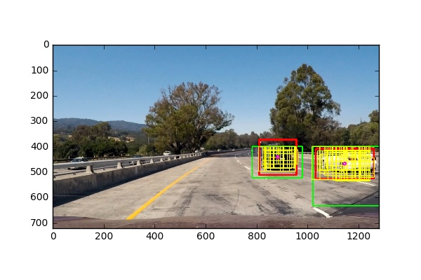

The heatmap of found hot windows overlap:

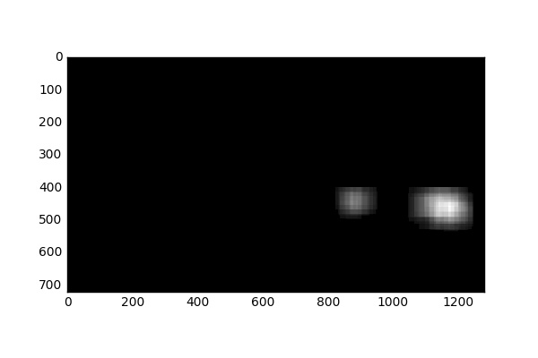

The final result of an image with cars boundaries and lane detection.

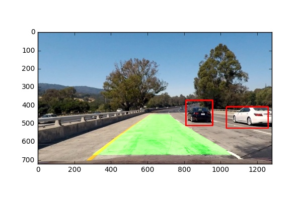


## Results and discussion

The pipeline is able to correctly lable cars areas on a video frames. The final video is [here](https://github.com/NikolasEnt/Vehicle-Detection-and-Tracking/blob/master/project_video_proc.mp4). The [Advanced Lane Line](https://github.com/NikolasEnt/Advanced-Lane-Lines) finding algorithm was added for the lane marking.

- Of course, the algorithm may fail in case of difficult light conditions, which could be partly resolved by the classifier improvement.

- It is possible to improve the classifier by additional data augmentation, hard negative mining, classifier parameters tuning etc.

- The algorithm may have some problems in case of car overlaps another. To resolve this problem one may introduce long term memory of car position and a kind of predictive algorithm which can predict where occluded car can be and where it is worth to look for it.

- To eliminate false positives on areas out of the road, one can deeply combine results from the Advanced Lane Line finding project to correctly determine the wide ROI on the whole frame by the road boundaries. Unfortunately, it was not correctly implemented (just hard coded, which is enought for the project but not a good implementation for a real-world application) due to time limitation.

- The pipeline is not a real-time (about 4 fps with Lane line detection, which independently performs at 9 fps). One can further optimize number of features and feature extraction parameters as well as number of analyzed windows to increase the rate because lane line detection is quite fast.  
